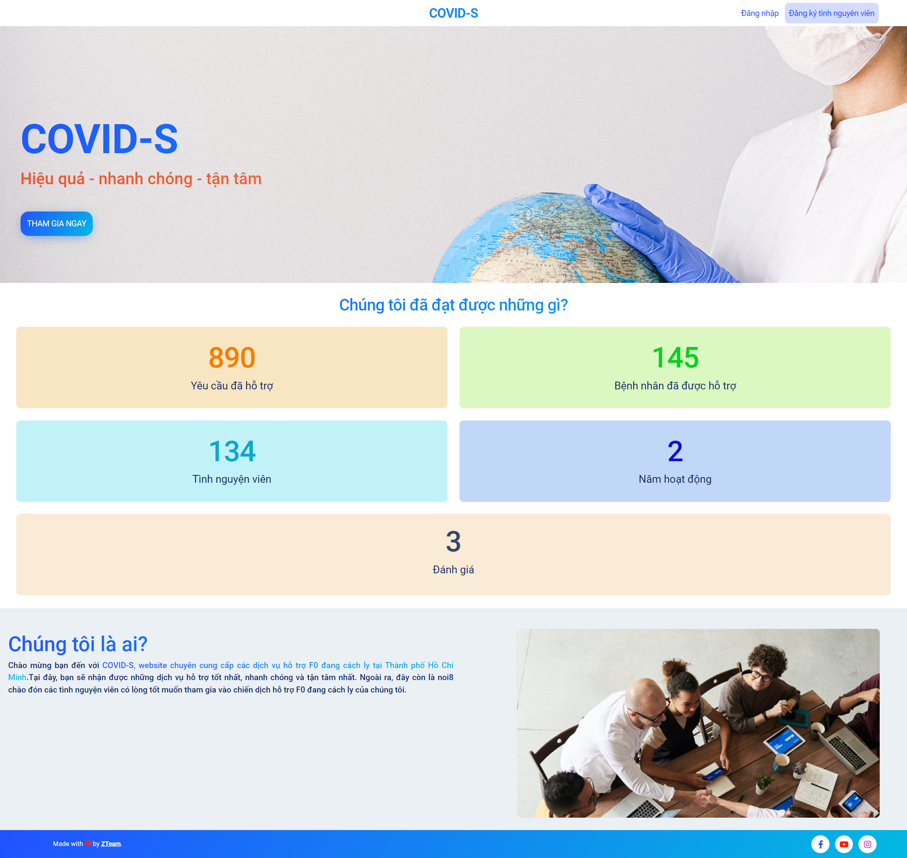
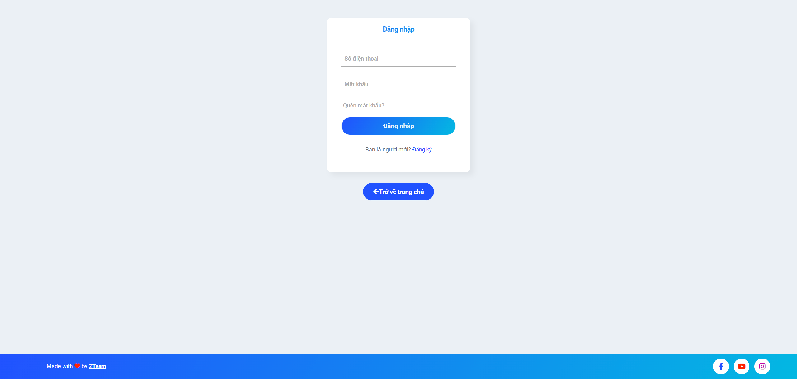
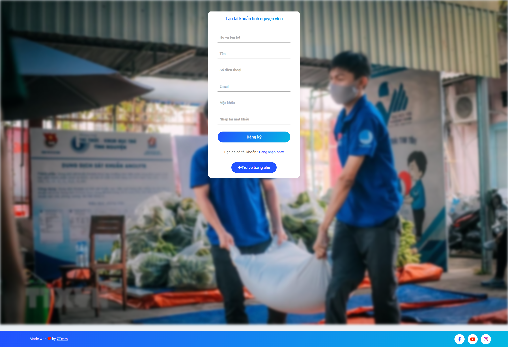
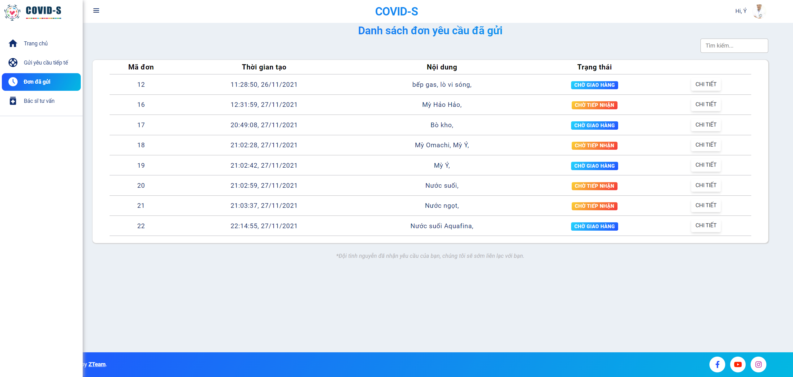
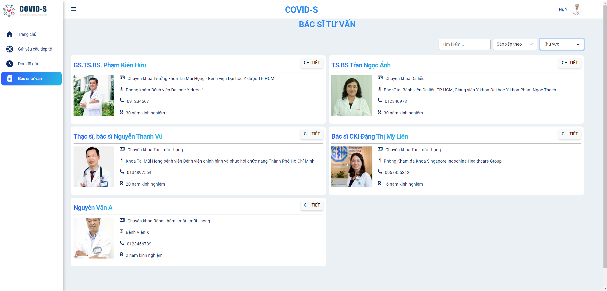
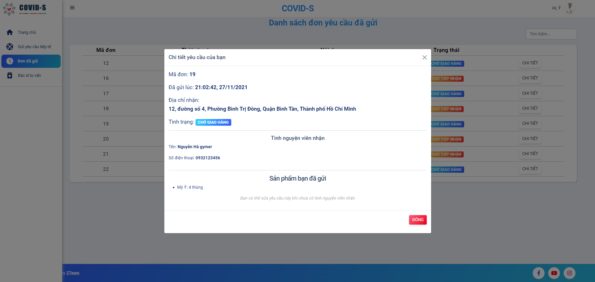
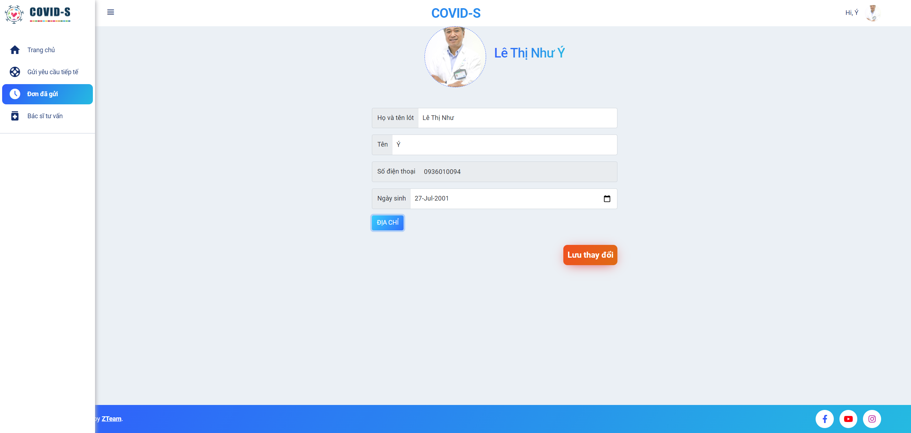
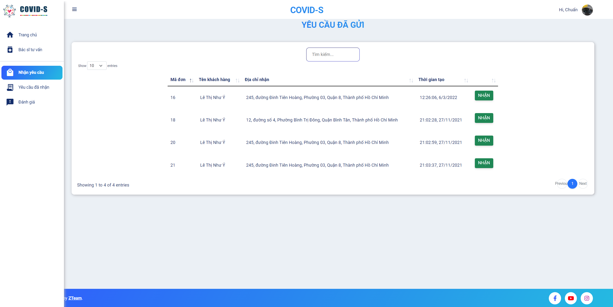
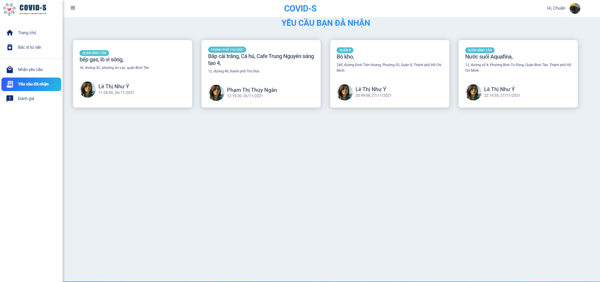

# COVID-S WEB APPLICATION

 

## MÔ TẢ DỰ ÁN

Đây là website hỗ trợ bệnh nhân mắc COVID-19. Trong quá trình bị cách ly, họ có thể gửi yêu cầu mua các vật dụng cần thiết thông qua website. Đội tình nguyện viên sẽ tiếp nhận và thực hiện cho họ. Ngoài ra, bệnh nhân cũng có thể xem thông tin các bác sĩ mà website tổng hợp để có thể liên lạc khi cần thiết. 
### **Hiện tại website chưa được public, chúng tôi sẽ cố gắng deploy trong thời gian sớm nhất.**   

## Hướng dẫn chạy ứng dụng:
**Lưu ý: máy tính cần cài đặt nodejs   **
Vào folder src/database, import file "covid_support.sql" vào DBMS mySQL (Xin lỗi vì sự bất tiện này)  
1. Tại folder gốc của dự án (covid-s-project) chạy lệnh `npm start` trong terminal.
    Theo mặc định port chạy ứng dụng là 3060 (có thể đổi port tại file index.js trong covid-s-project nếu bị xung đột)
    Nếu bị lỗi port 3060 đang sử dụng, chạy lệnh "npm stop" để kill toàn bộ port đang chạy và "npm start" lần nữa.
2. Sau khi hiển thị "Database is connected" trong console, vào trình duyệt nhập url: `localhost:3060`, truy cập ứng dụng thành công. 
## Giao diện
### **1. Giao diện dành cho người dùng (bệnh nhân)**  

Đây là giao diện trang chủ khi chưa đăng nhập

 

Giao diện trang đăng nhập

 

Giao diện trang đăng ký tình nguyện viên

 

Giao diện gửi yêu cầu tiếp tế của bệnh nhân sau khi đăng nhập

 

Giao diện các đơn yêu cầu và trạng thái

 

Giao diện thông tin bác sĩ tư vấn

 

Giao diện thông tin của một yêu cầu đã gửi

 

Giao diện thông tin cá nhân

 

### **2. Giao diện dành cho tình nguyện viên**  

Giao diện các yêu cầu bệnh nhân đã gửi

 

Giao diện các yêu cầu đã nhận

 

Giao diện thông tin của một yêu cầu

 
