# COVID-S WEB APPLICATION


## MÔ TẢ DỰ ÁN
Đây là website hỗ trợ bệnh nhân mắc COVID-19. Trong quá trình bị cách ly, họ có thể gửi yêu cầu mua các vật dụng cần thiết thông qua website. Đội tình nguyện viên sẽ tiếp nhận và thực hiện cho họ. Ngoài ra, bệnh nhân cũng có thể xem thông tin các bác sĩ mà website tổng hợp để có thể liên lạc khi cần thiết.<br />
### **Hiện tại website chưa được public, chúng tôi sẽ cố gắng triển khai trong thời gian sớm nhất.**<br /> <br />
### Video demo: https://youtu.be/AH7tFXVFTLw
## CÔNG NGHỆ SỬ DỤNG


<br><br>

## HƯỚNG DẪN CHẠY ỨNG DỤNG

**Lưu ý: máy tính cần cài đặt nodejs và xampp hoặc mySQL workbenchs** <br /><br />

1. Sử dụng XAMPP hoặc mySQL để import database từ `database/covids.sql`
2. Tại folder gốc của dự án (covid-s-project) chạy lệnh `npm start` trong terminal.
    Theo mặc định port chạy ứng dụng là 3060 (có thể đổi port tại file index.js trong covid-s-project nếu bị xung đột)
    Nếu bị lỗi port 3060 đang sử dụng, chạy lệnh `npm stop` để kill toàn bộ port đang chạy và `npm start` lần nữa.
2. Sau khi hiển thị `Database is connected` trong console, vào trình duyệt nhập url: `localhost:3060`, truy cập ứng dụng thành công.<br>
## Giao diện
### **1. Giao diện dành cho người dùng (bệnh nhân)**<br><br>
<p align='center'>Đây là giao diện trang chủ khi chưa đăng nhập</p>
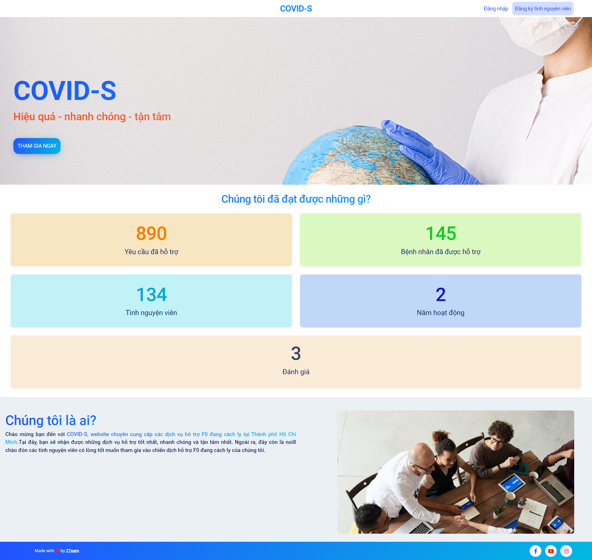<br><hr>
<p align='center'>Giao diện trang đăng nhập</p>
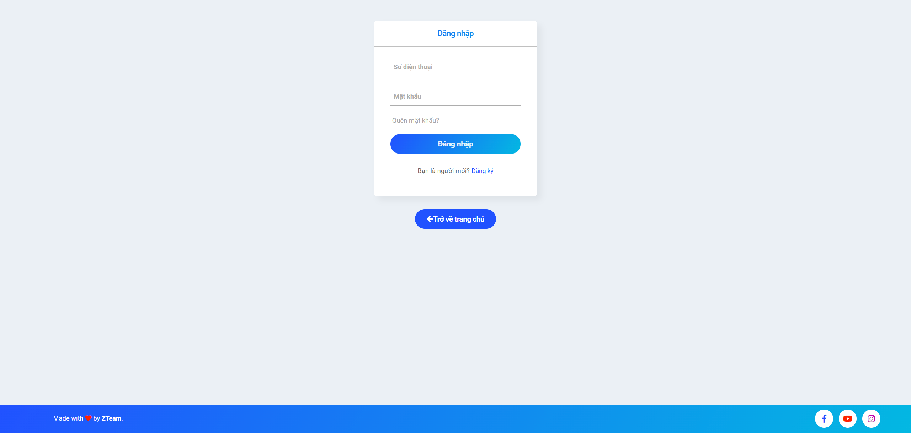<br><hr>
<p align='center'>Giao diện trang đăng ký tình nguyện viên</p>
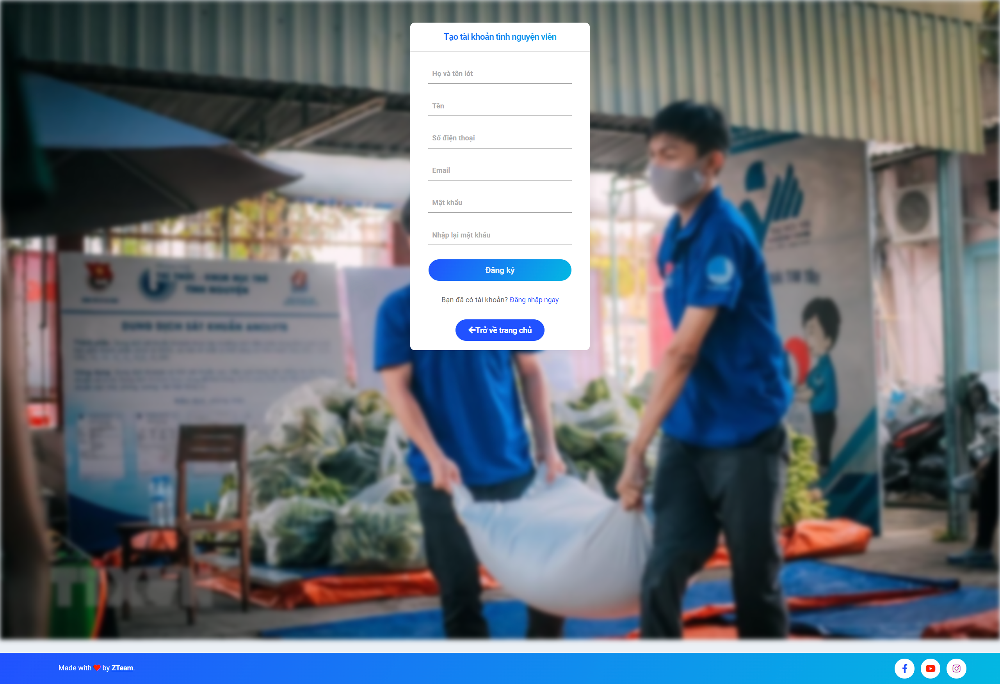<br><hr>
<p align='center'>Giao diện gửi yêu cầu tiếp tế của bệnh nhân sau khi đăng nhập</p>
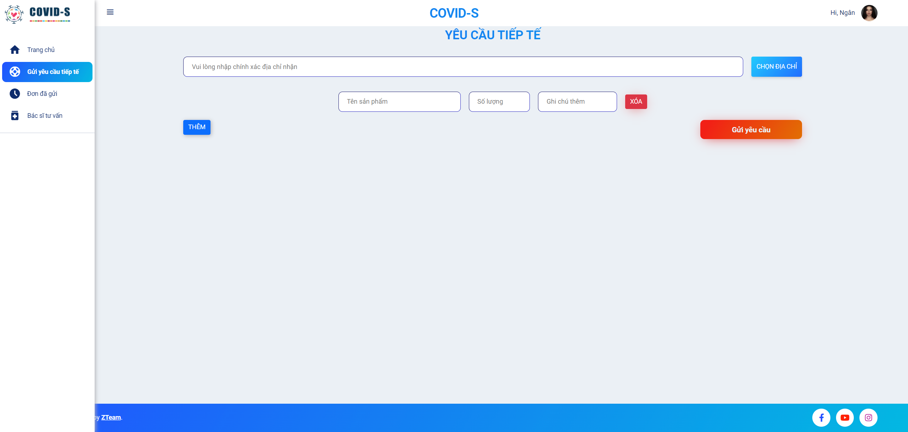<br><hr>
<p align='center'>Giao diện các đơn yêu cầu và trạng thái</p>
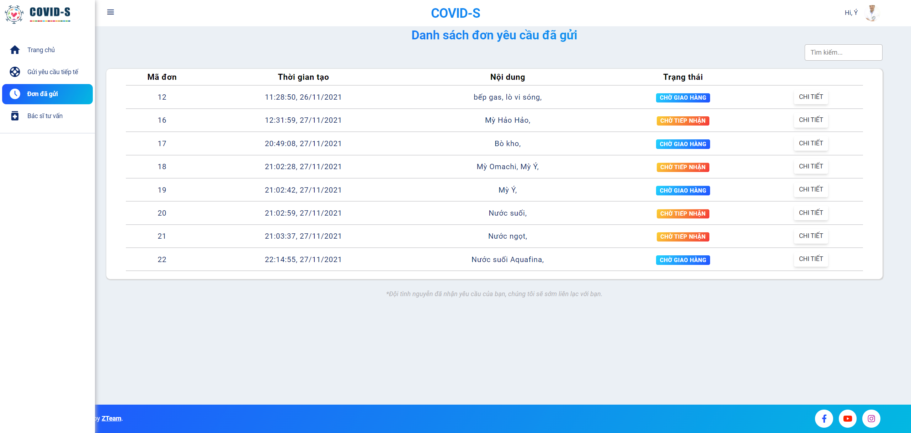<br><hr>
<p align='center'>Giao diện thông tin bác sĩ tư vấn</p>
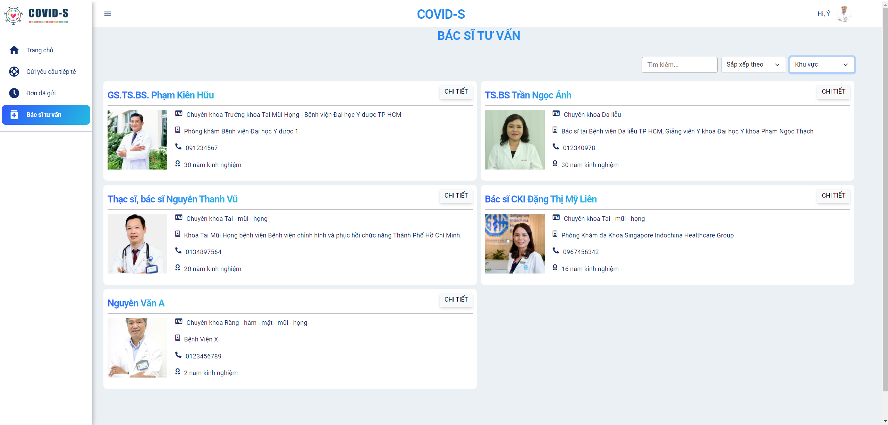<br><hr>
<p align='center'>Giao diện thông tin của một yêu cầu đã gửi</p>
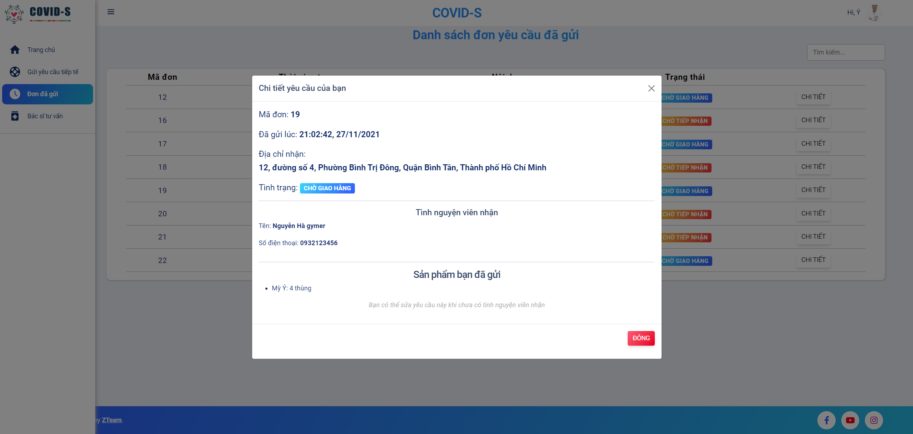<br><hr>
<p align='center'>Giao diện thông tin cá nhân</p>
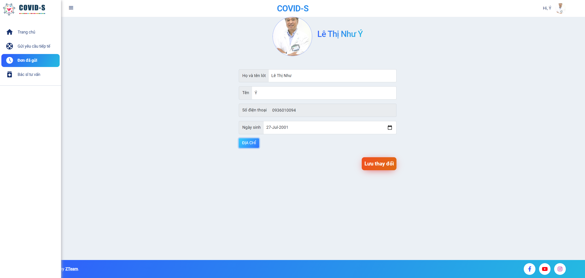<br><hr>

### **2. Giao diện dành cho tình nguyện viên**<br><br>
<p align='center'>Giao diện các yêu cầu bệnh nhân đã gửi</p>
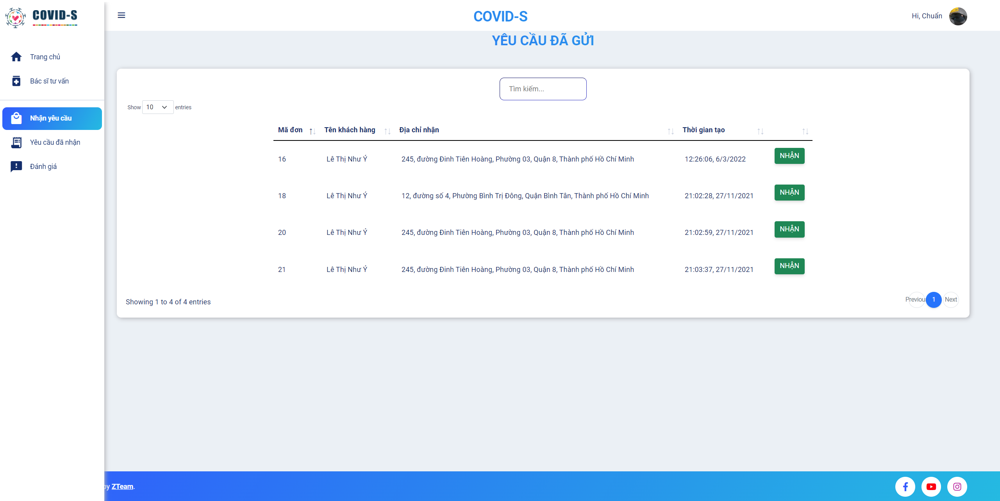<br><hr>
<p align='center'>Giao diện các yêu cầu đã nhận</p>
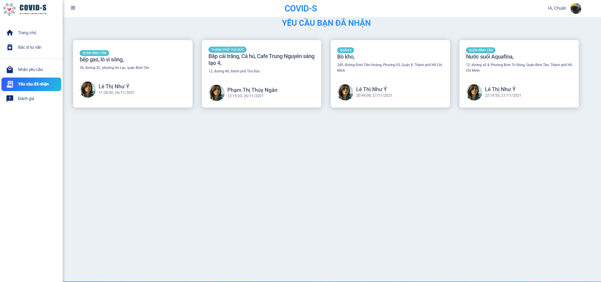<br><hr>
<p align='center'>Giao diện thông tin của một yêu cầu</p>
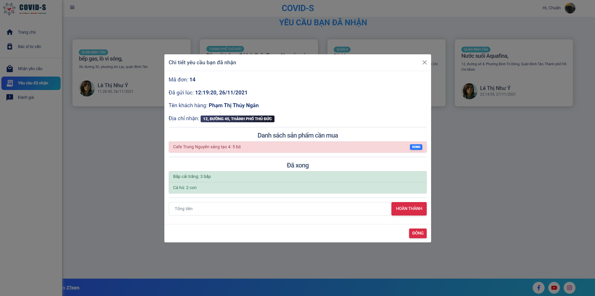<br><hr>

### **3. Giao diện dành cho quản lý hệ thống**<br><br>
<p align='center'>Giao diện quản lý chính</p>
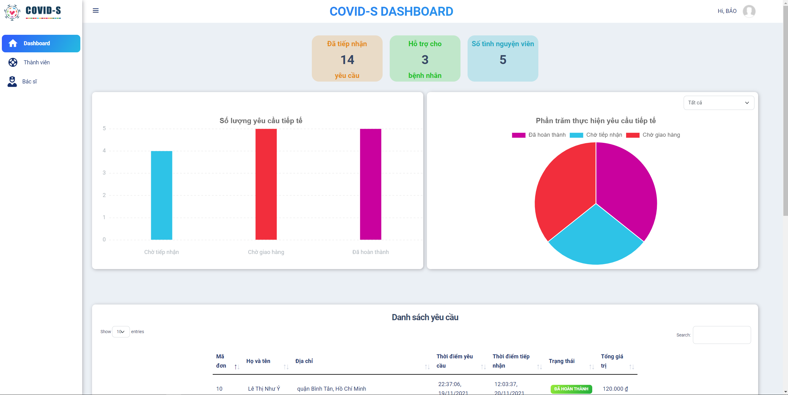<br><hr>

<p align='center'>Giao diện danh sách các yêu cầu đã gửi của bệnh nhân</p>
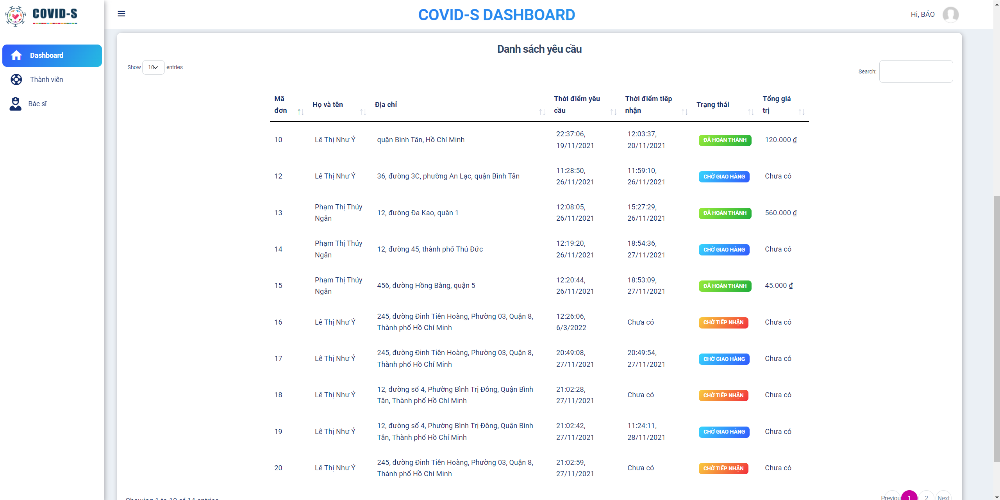<br><hr>

<p align='center'>Giao diện danh sách bác sĩ tư vấn</p>
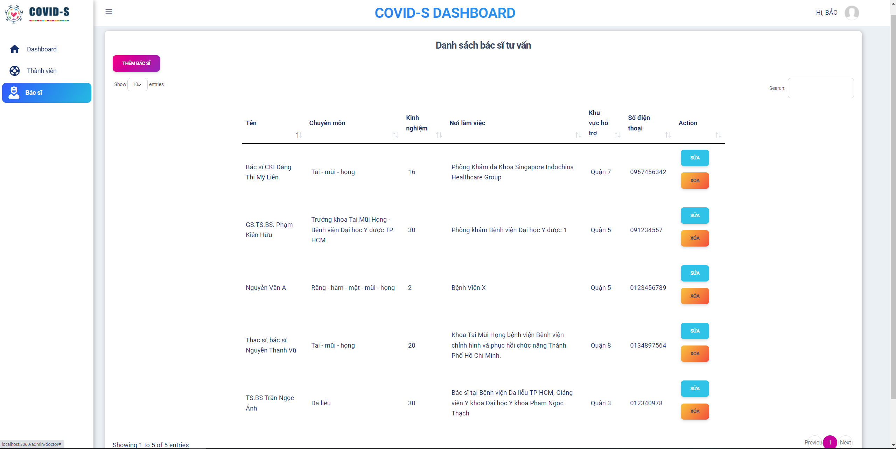<br><hr>

<p align='center'>Giao diện danh sách các tình nguyện viên</p>
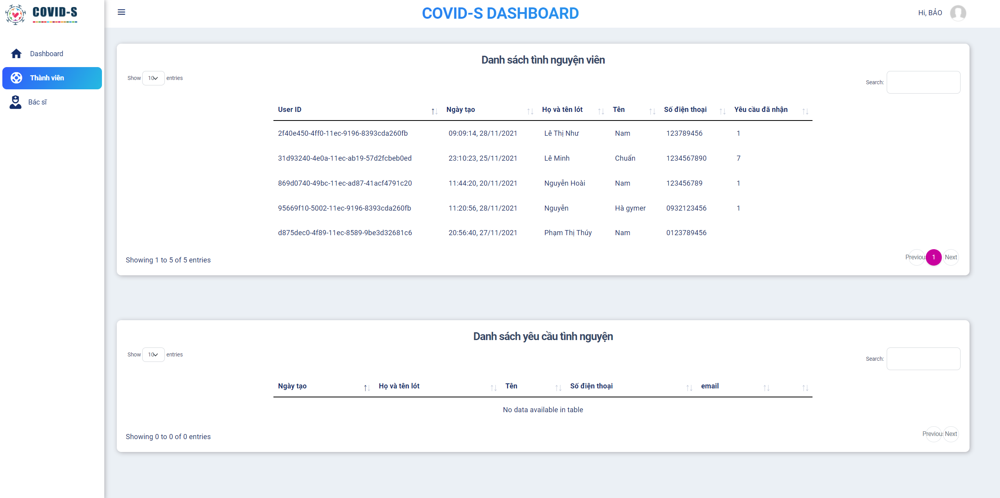<br><hr>
<p align='center'>Giao diện danh sách các tình nguyện viên</p>
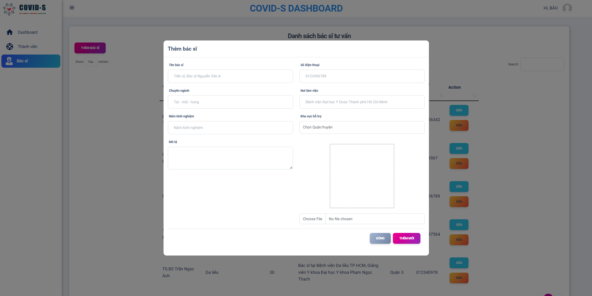<br><hr>

## ACCOUNT CÓ SẴN TRONG DATABASE

### **Admin**
```
Username: 0936010095
Password: admin
```
-------------------------------
### **Tình nguyện viên**
```
Username: 123456789
Password: 1234

Username: 1234567890
Password: lechuan
```
-------------------------------
### **Bệnh nhân**
```
Username: 0936010094
Password: 123

Username: 012345678
Password: ngan
```
-------------------------------

## CẦN CẢI THIỆN

1. Tối ưu code, tối ưu hiệu năng xử lý dữ liệu
2. Cập nhật lại một số giao diện
3. Tăng trải nghiệm người dùng (Không load lại trang đối với một số tính năng nhỏ như gửi yêu cầu tiếp tế,...)

## THÀNH VIÊN NHÓM ZTeam
- Thiên Bảo (leader): https://github.com/bao-nguyenbku
- Hoài Nam: https://github.com/HoaiNam071001
- Thuý Ngân: https://github.com/thuyngan1501
- Như Ý: https://github.com/Ayanami2603
- Minh Chuẩn: https://github.com/lechuan01
**<p align='center'>ZTeam make with ❤</p>**
